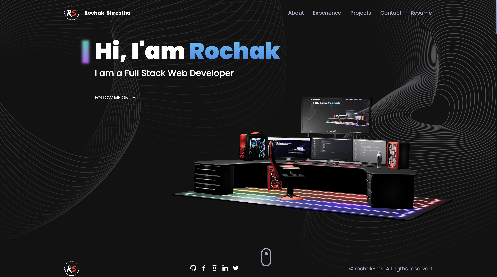
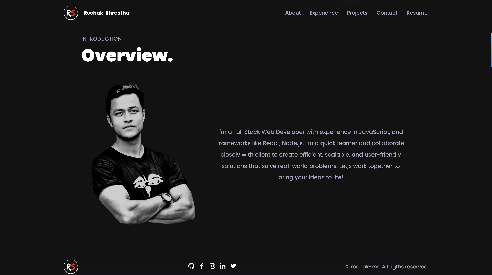
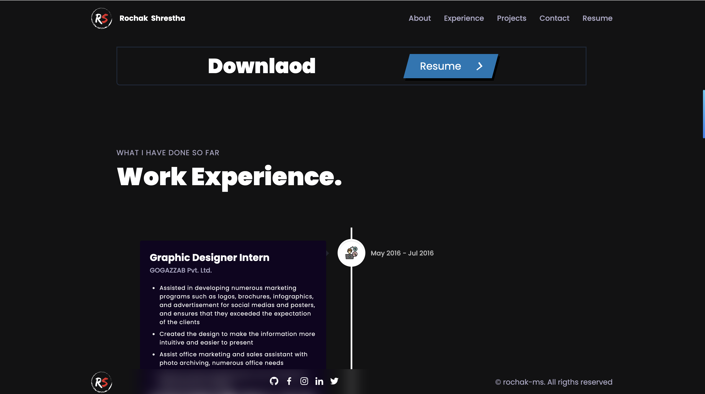
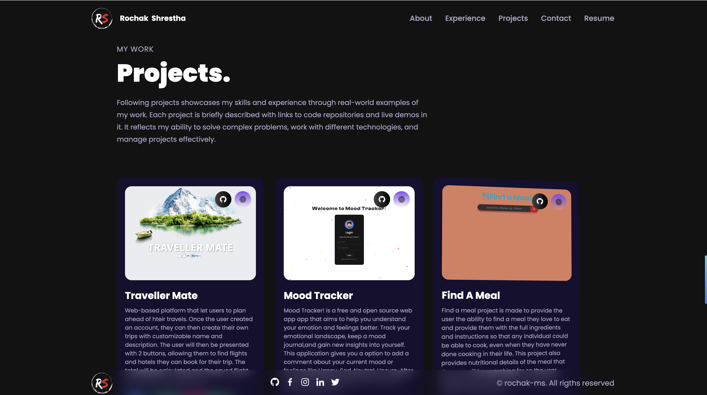
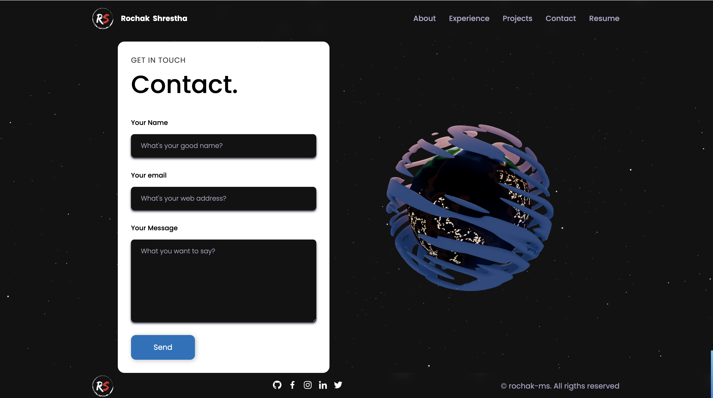

# Rochak Shrestha - Portfolio v2.0


## Description

This React Portfolio is a single-page application portfolio has a single Header, Navigation and Footer component that appears on multiple pages. When we open the Github page link first appear the homepage, if you want to open About me, Experience, Project, Resume and Contact, you can click the link at the top navigation bar links. This project used Vite and React - Virtual DOM ( Document Object Model) that make it faster. Rochak's Portfolio has display 6 projects: Traveller Mate, Mood Tracker, Find A Meal, Weather Dashboard, Text Editor, Book Search. This project also uses Thee.js to use javascript 3d library as displayed a deskop 3D on the home page.

## Table of Contents

- [Installation](#installation)
- [Usage](#usage)
- [License](#license)
- [Links](#links)
- [Badges](#badges)
- [Features](#features)
- [Contributing](#contributing)
- [Tests](#tests)
- [Questions](#questions)

## Installation

- Clone or Download the Repo on your local machine. Use the repository link from Links section below
- install the dependencies using `npm run install`
- Create a .env file into your root folder and use the following variable

  ```
  VITE_APP_EMAILJS_SERVICE_ID="your-service-id"
  VITE_APP_EMAILJS_TEMPLATE_ID="your-emailjs-template"
  VITE_APP_EMAILJS_PUBLIC_KEY="your-public-key"

  Note: This your can get from EmailJs website when your create your account. This is only require if you want to use the contact funtion in the project.
  ```

- run ` npm run dev` to run the project locally

## Usage

Open the => [Link](https://rochak-ms.github.io/rochak-ms/)

Below is the demo screenshots of the above link.

## Demo

### Home Page



### About Me



### Resume & Experience



### Projects



### Contact & Footer



## Links

#

[Deployed Page Link](https://rochak-ms.github.io/rochak-ms/)

[GitHub Repository Link](https://github.com/rochak-ms/rochak-ms)

## License

    This application is covered by the MIT license.


## Features

`NONE`

## Contributing

Pull request are welcome, you can make a constribution at the bottom of any docs page to make small changes such as a typo, sentence fix or a broken link. For major changes, please open an issue first to discuss what you would like to change.

## Tests

n/a

## Questions

If you have any question, [Email](rochak.ms@gmail.com)

----------OR------------

Find me on GitHub: [rochak-ms](https://github.com/rochak-ms)
